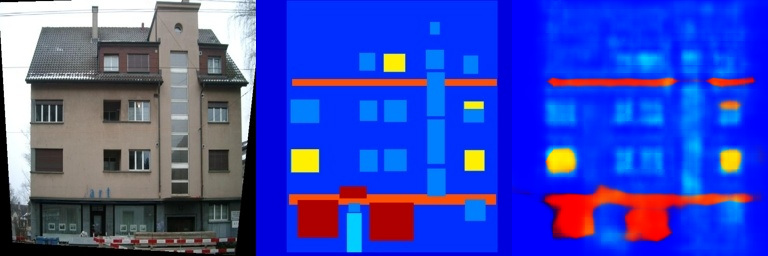
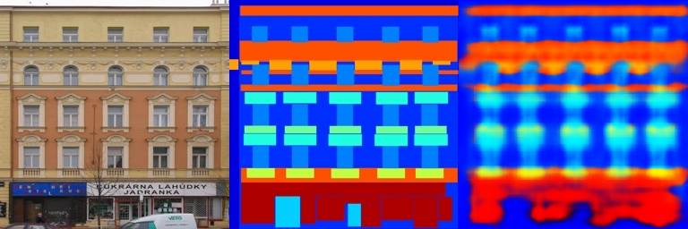

# Assignment 2 - DIP with PyTorch

### In this assignment, you will implement traditional DIP (Poisson Image Editing) and deep learning-based DIP (Pix2Pix) with PyTorch.
This repository is Wu Linxian's implementation of [Assignment 2 - DIP with PyTorch](https://github.com/YudongGuo/DIP-Teaching/tree/main/Assignments/02_DIPwithPyTorch). 

### Requirements
To run the examples, it is suggested to install the Conda environment as detailed below:
```setup
conda create -n DIP_2 Python=3.9
conda activate DIP_2
conda install pytorch torchvision torchaudio pytorch-cuda=11.8 -c pytorch -c nvidia
python -m pip install -r requirements.txt
```

---

### Running

To run Implement [Poisson Image Editing](https://www.cs.jhu.edu/~misha/Fall07/Papers/Perez03.pdf) with [PyTorch](https://pytorch.org/), run:

```basic
python run_blending_gradio.py
```


To run [Pix2Pix](https://phillipi.github.io/pix2pix/) with [Fully Convolutional Layers](https://arxiv.org/abs/1411.4038) implementation, run:

```bash
cd Pix2Pix
bash download_facades_dataset.sh
bash download_cityscapes_dataset.sh
python train.py
```

The provided code will train the model on the [Facades Dataset](https://cmp.felk.cvut.cz/~tylecr1/facade/). You need to use [other datasets](https://github.com/phillipi/pix2pix#datasets) containing more images for better generalization on the validation set.

---
### Results
### Poisson Image Editing
- Foreground Image with Polygon


- Background Image with Polygon Overlay


- Blended Image


### Pix2Pix


- train_results







- val_results   


## Acknowledgement

>📋 Thanks for the algorithms proposed by 
- [Paper: Poisson Image Editing](https://www.cs.jhu.edu/~misha/Fall07/Papers/Perez03.pdf)
- [Paper: Image-to-Image Translation with Conditional Adversarial Nets](https://phillipi.github.io/pix2pix/)
- [Paper: Fully Convolutional Networks for Semantic Segmentation](https://arxiv.org/abs/1411.4038)