# Assignment 3 - Play with GANs

### This repository is Wu Linxian's implementation of [Assignment 3 - Play with GANs](https://github.com/YudongGuo/DIP-Teaching/tree/main/Assignments/03_PlayWithGANs). 

\
See [作业03-Play_with_GANs.pptx](https://rec.ustc.edu.cn/share/705bfa50-6e53-11ef-b955-bb76c0fede49) for detailed requirements.


#   Using GANs in digital image processing.


### Requirements
To run the examples, it is suggested to install the Conda environment as detailed below:
```setup
conda create -n DIP_2 Python=3.9
conda activate DIP_2
conda install pytorch torchvision torchaudio pytorch-cuda=11.8 -c pytorch -c nvidia
python -m pip install -r requirements.txt
```

---

### Running

To run [Pix2Pix](https://phillipi.github.io/pix2pix/) with [Fully Convolutional Layers](https://arxiv.org/abs/1411.4038) implementation, run:

```bash
cd Pix2Pix
bash download_facades_dataset.sh
python train.py
```

or
```bash
cd Pix2Pix
bash download_cityscapes_dataset.sh
python train.py
```

The provided code will train the model on the [Facades Dataset](https://cmp.felk.cvut.cz/~tylecr1/facade/). You need to use [other datasets](https://github.com/phillipi/pix2pix#datasets) containing more images for better generalization on the validation set.

---
### Results

### Pix2Pix with GANs
The generator here still uses the [Fully Convolutional Layers](https://arxiv.org/abs/1411.4038) used in Assignment 2.

- train_results

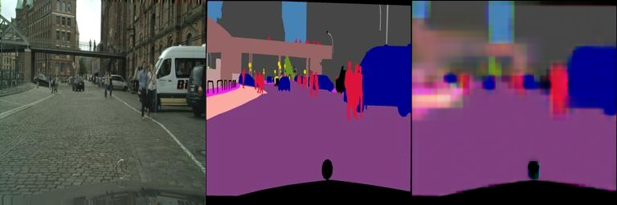

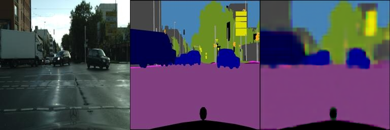

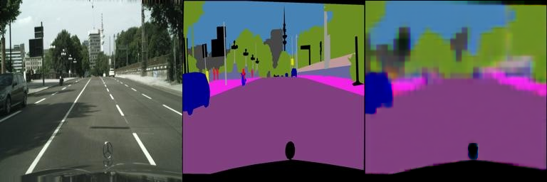

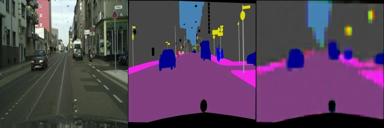

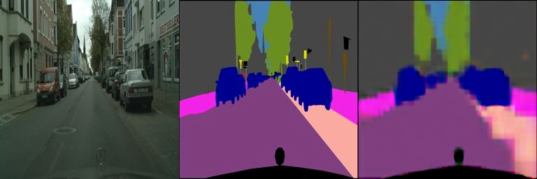

- val_results   

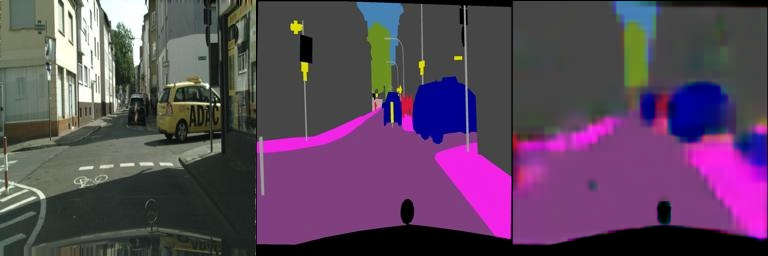

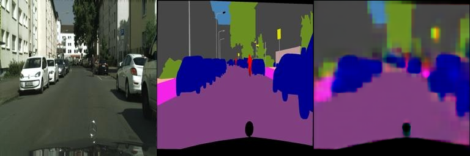

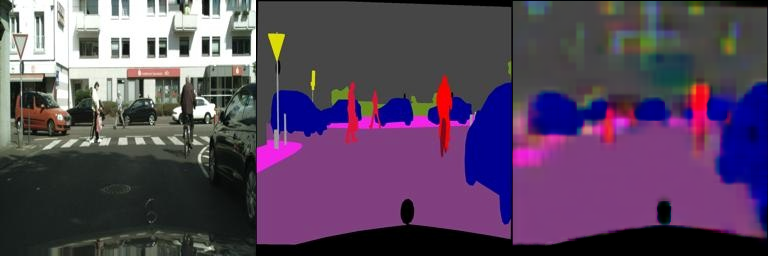


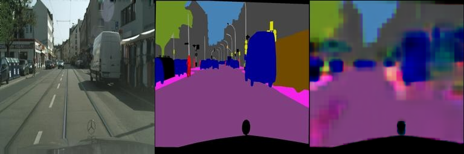
<br><br>

# DragGAN with Face-alignment

### Requirements

To run the examples, it is suggested to install the Conda environment as detailed below:
```setup
conda create -n draggan python=3.7
conda activate draggan

git clone https://github.com/1adrianb/face-alignment
pip install -r requirements.txt
python setup.py install

git clone https://github.com/Bmodest/DragGan-HW.git
cd DragGAN
pip install -r requirements.txt
pip install pydantic==1.10.11
```

---

### Running

```bash
# if you have a Nvidia GPU
python gradio_app.py
# if you use m1/m2 mac
python gradio_app.py --device mps
# otherwise
python gradio_app.py --device cpu
```


###  results
以下每行图片左侧为原始图片，右侧为修改后的图片

| 原始 | 闭眼 |
|---------|---------|
|  | 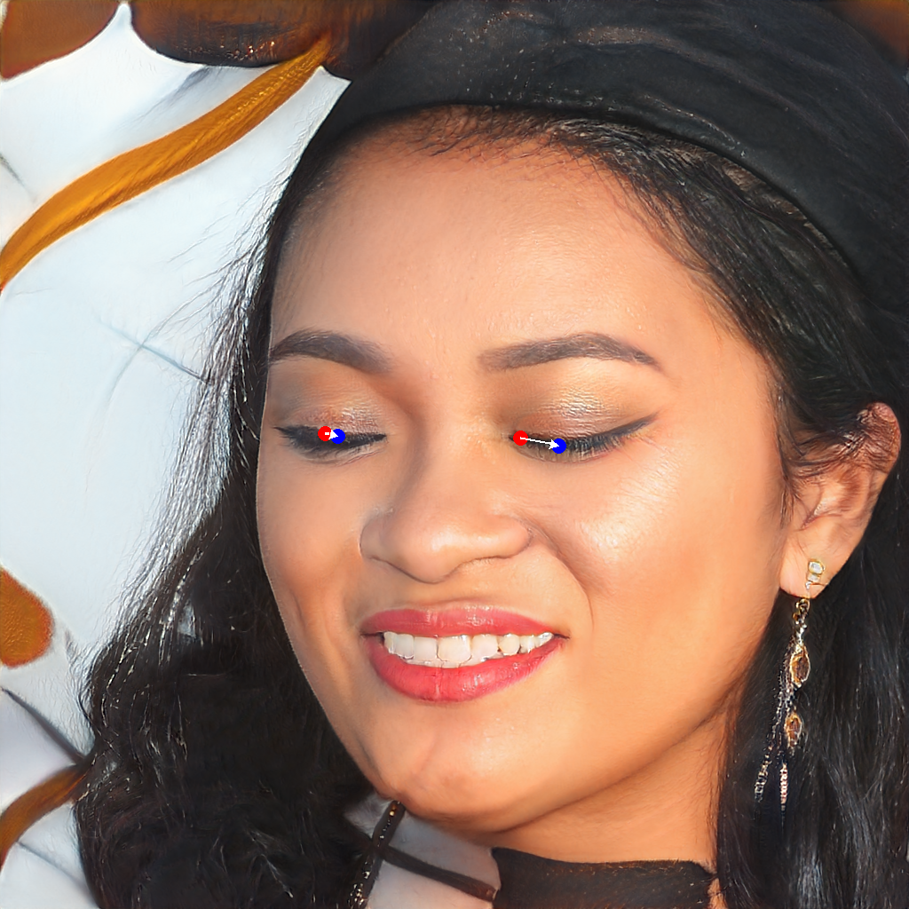 |

| 原始 | 瘦脸 |
|---------|---------|
|  | 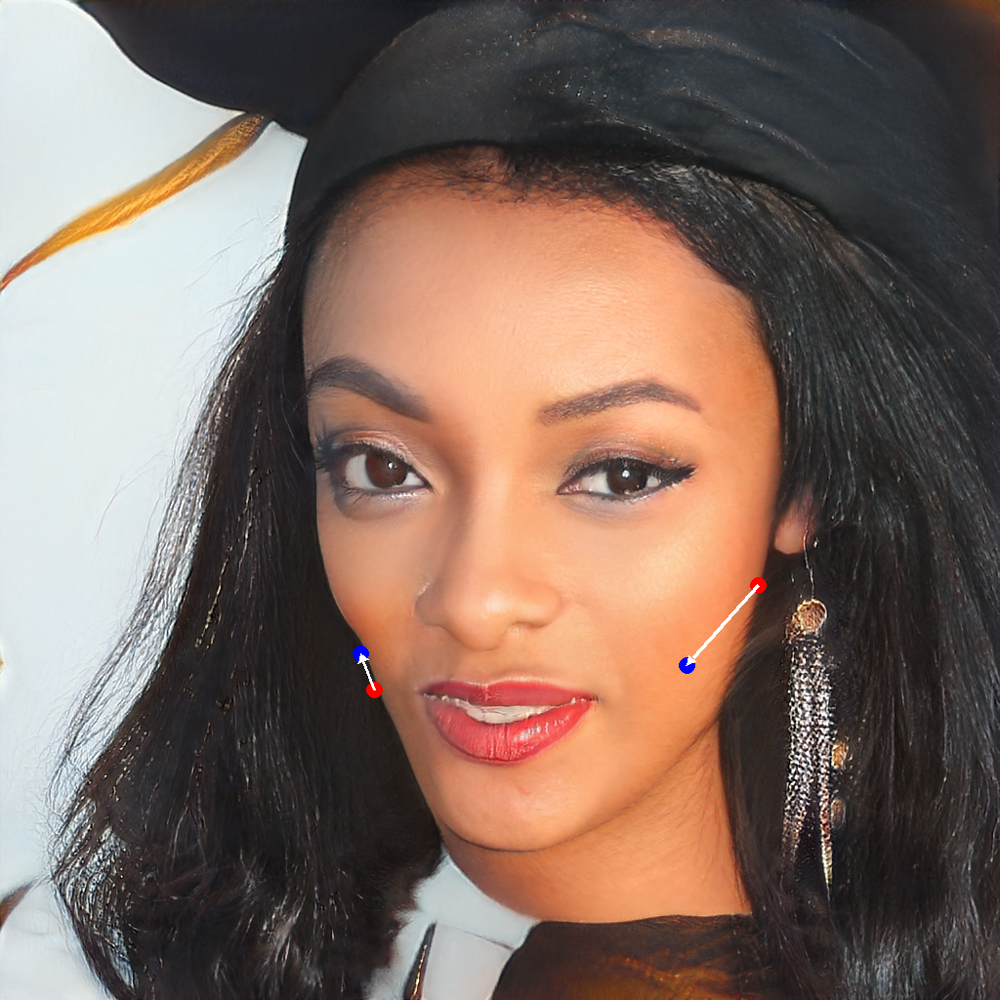 |

| 原始 | 大眼 |
|---------|---------|
|  | 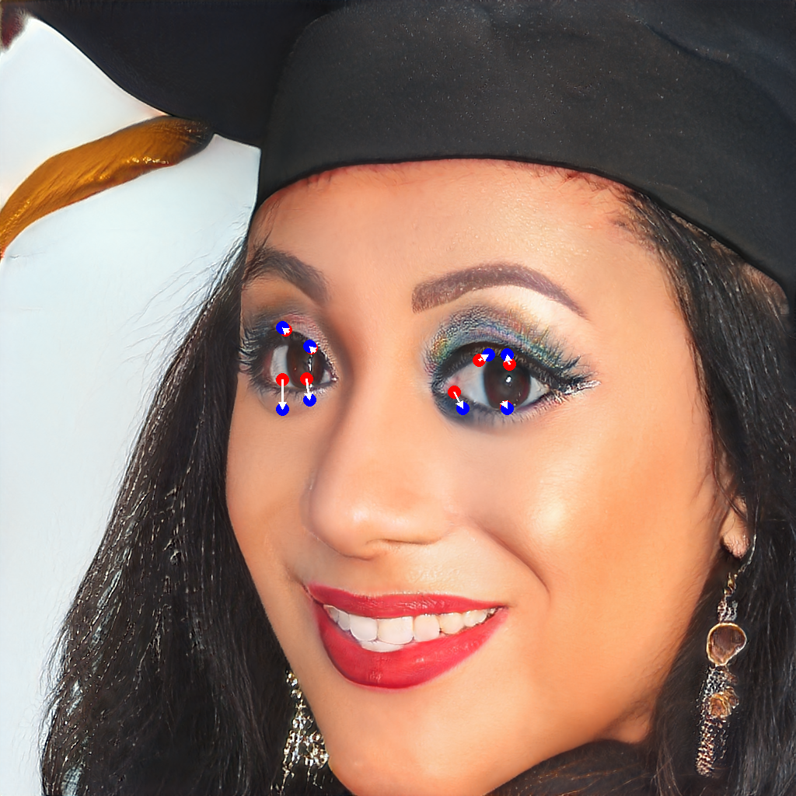 |

| 原始 | 微笑 |
|---------|---------|
|  | 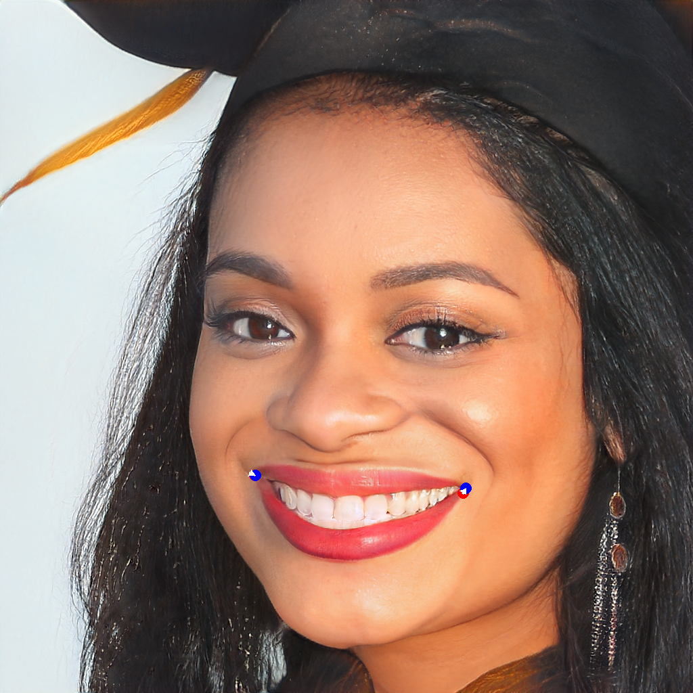 |


## Acknowledgement

>📋 Thanks for the algorithms proposed by 
- [Paper: Image-to-Image Translation with Conditional Adversarial Nets](https://phillipi.github.io/pix2pix/)
- [Paper: Fully Convolutional Networks for Semantic Segmentation](https://arxiv.org/abs/1411.4038)
- [DragGAN](https://vcai.mpi-inf.mpg.de/projects/DragGAN/): [Implementaion 2](https://github.com/OpenGVLab/DragGAN)
- [Facial Landmarks Detection](https://github.com/1adrianb/face-alignment)