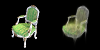
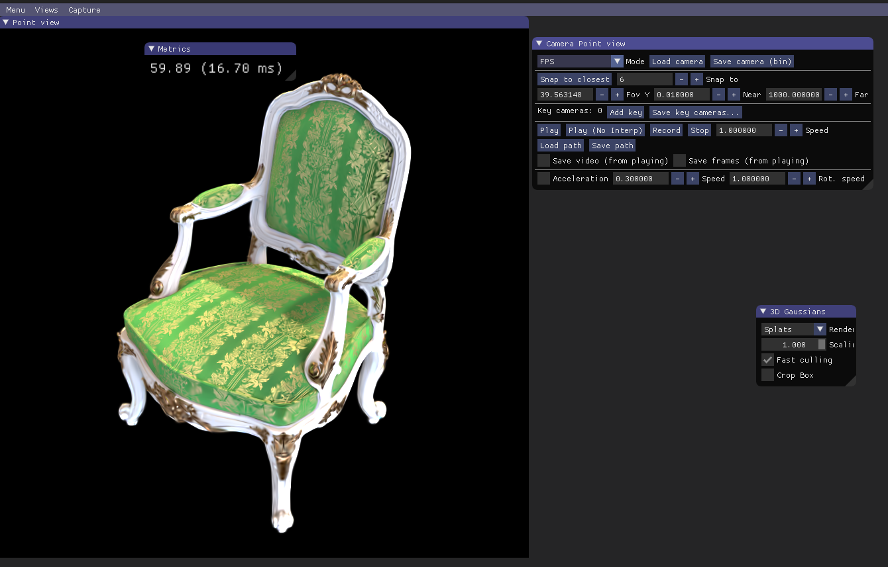

# Assignment 4 - Implement Simplified 3D Gaussian Splatting

This repository is Wu Linxian's implementation of [Assignment 4 - 3DGS](https://github.com/YudongGuo/DIP-Teaching/tree/main/Assignments/04_3DGS).

This assignment covers a complete pipeline for reconstructing a 3D scene represented by 3DGS from multi-view images. The following steps use the [chair folder](data/chair); you can use any other folder by placing images/ in it.

---

### Step 1. Structure-from-Motion
First, we use Colmap to recover camera poses and a set of 3D points. Please refer to [11-3D_from_Multiview.pptx](https://rec.ustc.edu.cn/share/705bfa50-6e53-11ef-b955-bb76c0fede49) to review the technical details.
```
python mvs_with_colmap.py --data_dir data/chair
```


After implementation, build your 3DGS model:
```
python train.py --colmap_dir data/chair --checkpoint_dir data/chair/checkpoints
```

---
### Results
### Poisson Image Editing
I meet some bug when I try to train more. It semms that something wrong with my code inducing Nan values in det of covr2D. The result before Nan is as follows:



- Original 3DGS




### Resources:
- [Paper: 3D Gaussian Splatting](https://repo-sam.inria.fr/fungraph/3d-gaussian-splatting/)
- [3DGS Official Implementation](https://github.com/graphdeco-inria/gaussian-splatting)
- [Colmap for Structure-from-Motion](https://colmap.github.io/index.html)
